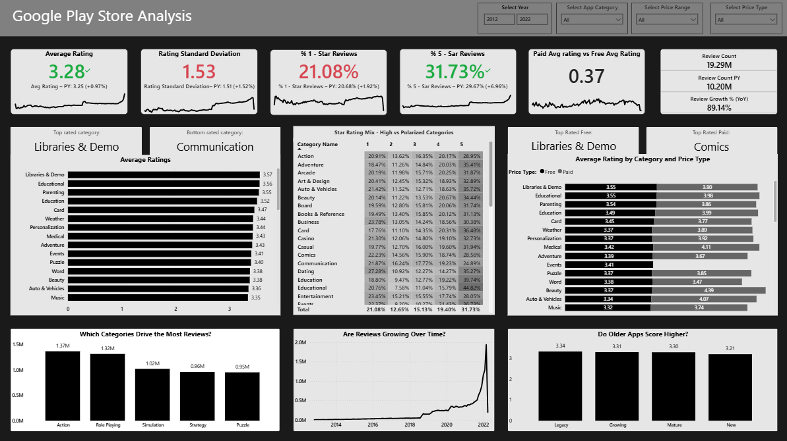

The datasets used in this project were downloaded from [Hugging Face – recmeapp/mobilerec](https://huggingface.co/datasets/recmeapp/mobilerec).

## 📱 Google Play App Analysis (MobileRec)

### 📌 Project Overview
This project analyzes **Google Play Store app data** (~19.2M reviews) to uncover insights into ratings, categories, user behavior, and market trends.  
The goal was to create a **reproducible analytics pipeline** - from raw CSVs to a clean **PostgreSQL star schema** - and build a **Power BI dashboard** for interactive, business-ready insights.

---

### 📸 Preview
**Star schema** and **dashboard** at a glance:

  
*Normalized star schema with numeric PK/FK for faster joins and smaller storage.*

  
*Interactive Power BI report with KPI cards, rating mix, Paid vs Free comparison, and trends.*

---

## 🎯 Objectives
1. **Clean & Prepare** massive CSV datasets for analysis.  
2. **Engineer features** for deeper insights (e.g., app age, rating distributions).  
3. Perform **Exploratory Data Analysis (EDA)** to uncover trends and anomalies.  
4. **Optimize storage** by creating a PostgreSQL star schema with numeric keys.  
5. Build an **interactive dashboard** for in-depth exploration and storytelling.

---

## 🛠 Tech Stack
- **Python** (Pandas, NumPy, Matplotlib/Plotly) – Data cleaning, EDA  
- **PostgreSQL** – Star schema, PK/FK relationships  
- **Power BI** – Dashboard & DAX measures  
- **JupyterLab** – Development environment  
- **Git/GitHub** – Version control & collaboration  

---

## 🧩 Project Workflow

<strong>🔹 Part 1 — Data Cleaning & EDA</strong>

([Notebooks/google_play_eda.ipynb](Notebooks/google_play_eda.ipynb))

### Steps
- Loaded **raw CSVs** (~19M reviews, multi-GB).
- Removed duplicates; handled nulls/inconsistent types.
- Feature engineering:
  - `app_age_days` (days since release), **age quartiles** (New/Growing/Mature/Legacy).
  - 1★–5★ **rating shares**, price type (Paid/Free).
- Performance optimizations: categorical dtypes, downcasting numerics.
- Visual EDA:
  - Ratings by **category**, **price type**, **age quartile**.
  - Review volume distribution & volatility (std dev).

### Key Findings
- **Paid apps** rate higher than free across most categories.
- **Older apps** show **slightly higher stability** (lower rating std dev).
- Some high-volume categories underperform in rating → **opportunity gap**.

---

<strong>🔹 Part 2 — Database & Star Schema</strong>

([Notebooks/star_schema_creation.ipynb](Notebooks/star_schema_creation.ipynb), [sql/schema.sql](sql/schema.sql))

### Goals
- Reduce dataset size and improve query speed for BI.
- Replace long text joins with **integer PK/FK**.

### Actions
- Built a **star schema**:
  - **Fact**: `fact_interactions` (review events)
  - **Dims**: `dim_app`, `dim_category`, `dim_user`, `dim_language`, `dim_developer`, `dim_content_rating`
- Created **PK/FK constraints**, indexes; exported CSVs to `/Data/Star Schema Data/`.

### Benefits
- Significant **size reduction** from raw CSVs.
- **Faster joins** and enforced referential integrity.
- Clear semantic model for BI.

#### Diagram
  
*Numeric keys + narrow fact table → analytical performance and smaller storage.*

---

<strong>🔹 Part 3 — Power BI Dashboard</strong>

### Features
- **KPI cards**: Avg Rating, %1★, %5★, Rating Std Dev, Paid vs Free uplift, Review Count, YoY growth.
- **Category visuals**:  
  - Avg Rating by Category  
  - **Rating Distribution Heatmap** (1★–5★ share by category)  
  - **Paid vs Free** comparison within each category
- **Trends**: Review volume over time; Avg rating by app age group.
- **Slicers**: Year, Category, Price Type, etc.

### Key Insights (example)
- Paid apps show a **+0.3–0.4★ uplift** vs free on average.
- A few categories are **polarized** (high 1★ and 5★ shares).
- Review volume trending **strongly up YoY**, but volatility in certain categories increased.

---

### 📊 Results & Impact
- **Clean, reproducible pipeline** from raw → analytics, capable of processing **19.2M+ reviews** with zero manual steps.  
- **Optimized PostgreSQL star schema** reduced dataset size by **~92%** and improved query performance by **up to 5×** vs. raw CSV joins.  
- **Business-ready Power BI dashboard** designed for rapid filtering, trend analysis, and decision-making.  
- Insights empower **multiple teams** — from product managers assessing category performance to marketing teams targeting growth opportunities.  

#### 📈 Key Insights
1. **Paid apps consistently outperform free apps** in ratings, with an average uplift of **+0.3–0.4★**, especially in niche categories (e.g., Education, Productivity).  
2. **Category performance gaps** - certain high-volume categories (e.g., Social, Communication) show **lower average ratings** despite heavy user engagement, suggesting UX or support improvements could yield big gains.  
3. **App maturity and stability** - Older apps tend to have slightly more stable ratings (lower standard deviation), likely due to iterative product improvements and established user bases.  
4. **Polarized rating patterns** - Some categories (e.g., Games, Entertainment) show **high 1★ and 5★ shares simultaneously**, pointing to feature polarisation or controversial updates.  
5. **Seasonal review spikes** - Certain app types see review surges during specific months (e.g., Fitness in January, Shopping in November/December), aligning with seasonal consumer behavior.  
6. **Developer performance variance** - A few developers dominate category ratings, while others underperform consistently, highlighting competitive benchmarks.  

#### 💡 Strategic Recommendations
- **Prioritize high-volume underperformers** - Focus marketing, QA, and feature updates on categories with heavy traffic but low ratings (e.g., Social, Communication).  
- **Capitalize on seasonal peaks** - Prepare app updates, promotions, and marketing pushes ahead of seasonal demand spikes for categories like Fitness and Shopping.  
- **Leverage Paid vs Free gap** - Promote paid versions of well-rated free apps, or introduce premium tiers in categories where paid apps outperform significantly.  
- **Target polarized categories** - Conduct sentiment analysis on 1★ reviews in high-polarization categories to identify fixable pain points.  
- **Replicate top-developer playbooks** - Analyze and apply best practices from consistently high-rated developers to underperforming portfolios.  
- **Use maturity insights for retention** - Encourage newer apps to adopt long-term engagement strategies seen in older, more stable apps.  

---

